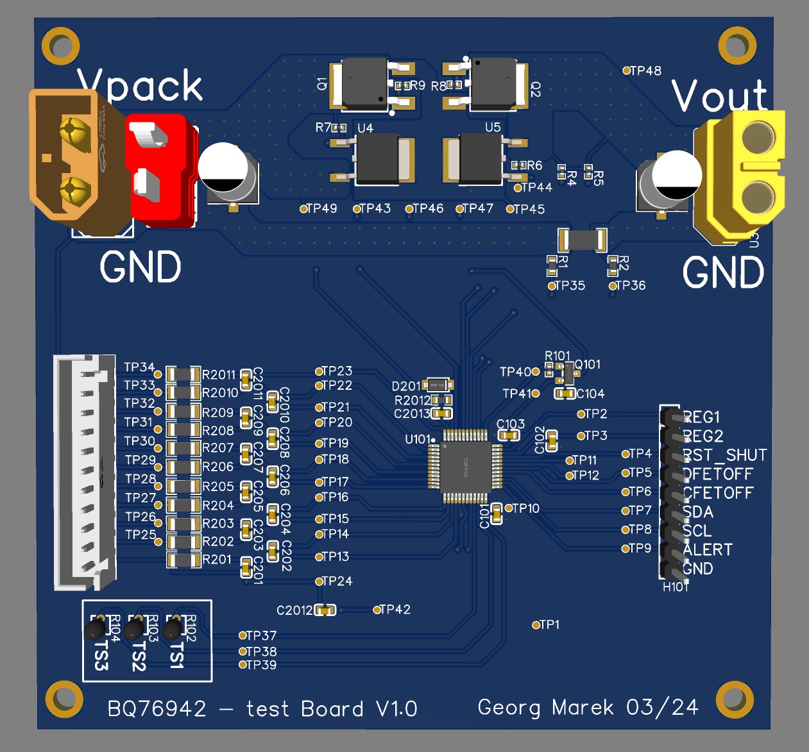

# BQ76942-pcbs-esp32
a repo that contains test PCBs and code for the BQ76942 chip.

[Easyeda Project](https://easyeda.com/editor#id=f5f4d9792d09474ea4b0e3cc912bd76b|1c698f998313432a857b05c3b1bb7821)

## test123

this is very good content lol

